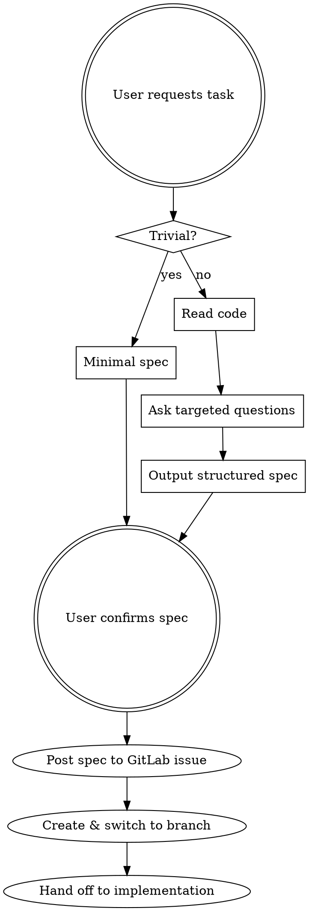

# Feature Spec

**Purpose:** Mandatory pre-implementation step. Reads the project code, asks targeted questions, outputs a structured spec so implementation needs only targeted `Read` + `Edit` calls.

**Core principle:** Targeted reads, not blanket scanning. Ask questions, then spec. No Explore or Plan agents.

## When to Use

- Any task that will modify the codebase
- New features, bug fixes, refactors, additions
- Before entering plan mode or writing code

**When NOT to use:**
- Pure research/exploration questions ("how does X work?")
- Reading or explaining existing code without changes
- Trivial tasks (typo fix, single-line change) — produce minimal spec instead

## Protocol



### Step 1: Read the code

CLAUDE.md is already loaded in the system prompt — do NOT re-read it.

1. Read `start_work.py` — the entire application (~107 lines)
2. If the task involves configuration, check the `.env` variable names listed in CLAUDE.md's Configuration table
3. If new dependencies might be needed, read `requirements.txt`

### Step 2: Ask targeted questions via AskUserQuestion

- What's the task? (if not already clear)
- Which handler/function is affected? (`monitor_new_messages`, `send_alert`, `process_history`, `main`, or new?)
- Are new `.env` variables needed?
- Which Pyrogram filters apply? (`filters.chat`, `filters.text`, `filters.regex`, etc.)
- Does this change the alert format?
- Edge cases or constraints?

**Skip questions the user already answered in their initial message.**

### Step 3: Output structured spec

```markdown
## Task: [name]

### Context
Why this change is needed.

### Behavior
- What it does (user-facing)
- Trigger conditions
- Expected outcomes

### Files to Modify
- `start_work.py` — what changes here
- `.env` — new variables (if any)
- `requirements.txt` — new dependencies (if any)

### Pattern to Follow
Reference existing handler/function pattern from the codebase.

### Configuration Changes (.env)
- New variables: `VAR_NAME` — description, type
- Changed variables: what changed

### Dependencies
- New pip packages (if any)

### Edge Cases
- List of edge cases identified

### Verification
- How to test this works (manual testing steps)
```

### Step 4: Confirm

Ask user to confirm or adjust the spec before proceeding to implementation.

**For trivial tasks**, output only: Files to Modify + Verification.

### Step 5: Post spec as GitLab issue comment

Once the user confirms the spec:

1. Ask for the issue number if not already known from context (e.g. "Which GitLab issue is this for? (e.g. #2)")
2. Post the full confirmed spec as a comment on that issue using the `gitlab` skill:

```bash
curl -s -X POST "https://gitlab.kidsgames.top/api/v4/projects/6/issues/:iid/notes" \
  -H "PRIVATE-TOKEN: <TOKEN>" \
  -H "Content-Type: application/json" \
  -d '{"body": "## Implementation Plan\n\n<spec content>"}'
```

3. Also move the issue to **In Progress** at this point (remove `Todo`, add `In Progress` label).

### Step 6: Create and switch to the issue branch

Before any implementation begins, set up the working branch:

1. Check if GitLab auto-created a branch for the issue:
   ```bash
   git fetch origin
   git branch -r | grep "origin/{iid}-"
   ```
2. **If branch exists** — check it out locally:
   ```bash
   git checkout -b {branch-name} origin/{branch-name}
   ```
3. **If no branch exists** — create one on GitLab and check it out:
   ```bash
   curl -s -X POST "https://gitlab.kidsgames.top/api/v4/projects/6/repository/branches" \
     -H "PRIVATE-TOKEN: <TOKEN>" \
     -H "Content-Type: application/json" \
     -d '{"branch":"{iid}-short-description","ref":"develop"}'

   git fetch origin
   git checkout -b {iid}-short-description origin/{iid}-short-description
   ```

**Do NOT write any code until you are on the issue branch.** Verify with `git branch --show-current`.

### Step 7: Hand off to implementation skills

Based on the confirmed spec, invoke `python-feature` skill for implementation.

After implementation is complete, invoke `writing-tests` if tests are appropriate for the change.

`python-feature` enforces: async handlers → Pyrogram decorators → config loading → logging in Russian → CLAUDE.md update.

## Rules

- NEVER spawn Explore or Plan agents
- ONLY use Read, Glob, Grep (targeted), and AskUserQuestion
- Read `start_work.py` once — no repeated reads
- Output spec as conversation text, not a file
- Skip questions already answered by the user's initial message
